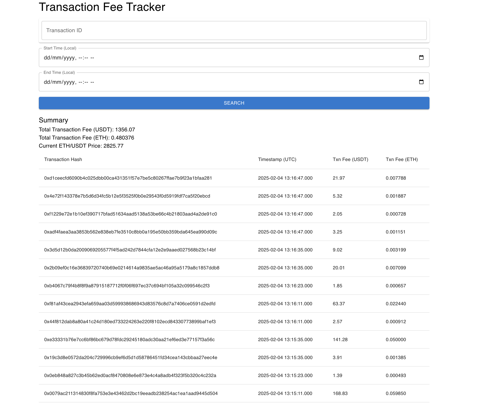

# Web3 Transaction Fee Tracker

A simple but robust analytics microservice that continuously fetches and saves Ethereum transactions data as well as related historical prices.

## Technology Stack and Features

- [**FastAPI**](https://fastapi.tiangolo.com) for the Python backend API.
    - [SQLModel](https://sqlmodel.tiangolo.com) for the Python SQL database interactions (ORM).
    - [Pydantic](https://docs.pydantic.dev), used by FastAPI, for the data validation and settings management.
    - [PostgreSQL](https://www.postgresql.org) as the SQL database.
- [React](https://react.dev) for the frontend.
- [Docker Compose](https://www.docker.com) for development and production.
- Tests with [Pytest](https://pytest.org)
- Historical transactions data from [Etherscan](https://docs.etherscan.io/api-endpoints/accounts#get-a-list-of-erc20-token-transfer-events-by-address)
- Search by transaction hash with [Infura/Metamask](https://docs.metamask.io/services/)
- Latest ticker prices and Klines data from [Binance](https://developers.binance.com/docs/binance-spot-api-docs/rest-api/market-data-endpoints#symbol-price-ticker)

## How To Run

### 1. Configurations

A `.env` file is needed in the root directory for loading configurations. A sample `.env.example` is provided with the recommended default values.

You can update configs in the `.env` files to customize your configurations.

Before deploying it, it is necessary to update the values for the following secrets:

- `POSTGRES_PASSWORD`
- `INFURA_API_KEY`
- `INFURA_HTTPS`
- `BINANCE_API_KEY`
- `ETHERSCAN_API_KEY`

You can (and should) pass these as environment variables from secrets.

### 2. Docker Compose

After ensuring the `.env` file is properly configured and in the right directory, run `docker compose up --build` from the root directory where the `docker-compose.yml` file is. The `frontend` service will be the last to run, as it depends on the `db` and `backend` to be running first.

Once all required services are up and running, access the UI via [localhost:3000](http://localhost:3000/).

## Backend Features

### 1. Real Time Transacton Data Recording
After the backend is started, it continuously fetchs and saves transaction data at a user configured time interval

### 2. Batch Historical Data Recording
From configurations or DB, it can be configured as to how far back should historical data be started to be recorded.

### 3. Search Transaction Data by Transaction Hash and Time Range
Service will first attempt to fetch the data from DB. If it doesn't exist, it will then proceed to search for data from external providers, and saves to DB after. 

## Frontend Features

### 1. Simple One Page UI with pagination support

### 2. Live ETHUSD price, with Transaction Data summary within the given page's results

## Tokka Engineering Challenge 

### 1. Availability, scalability, and reliability - Please take these into consideration when you design the system and explain how your system fulfills them.

Availability: The backend service can be configured to run with multiple workers, and can also be configured in k8s with HPA to enable auto-scaling during periods of high workload, such as when a requirement comes in to batch save transaction data over a long period of time.

Scalability: The backend service is highly scalable, with the service itself being configurable to run with multiple workers. In addition, since this service is expected to be read heavy, Postgres supports read replicas so we can split read/write traffic if necessary

Reliability: Healthcheck endpoint is provided for prompt discovery should the service go down. In addition, the service providers used in the backend are all easily configurable. Should a particular service provider go down, we can easily swap them out to another e.g. Infura to Alchemy.

### 2. Optimizations if any

1. I have made the assumption that this service is meant for analytics on past data purposes, and as such, does not have a high requirement for latency since past data has already happened. If latency is a requirement, we could add a Redis cache layer to our service, where we store frequently accessed data in cache for speedy retrieval.

2. The batch historical data recording feature can be further optimized to be in the form of a UI feature, where a user can specifically indicate the range of historical data they would like. For this challenge, due to the limitation of time, I have not featurized it and instead left it as a configuration from DB. 

